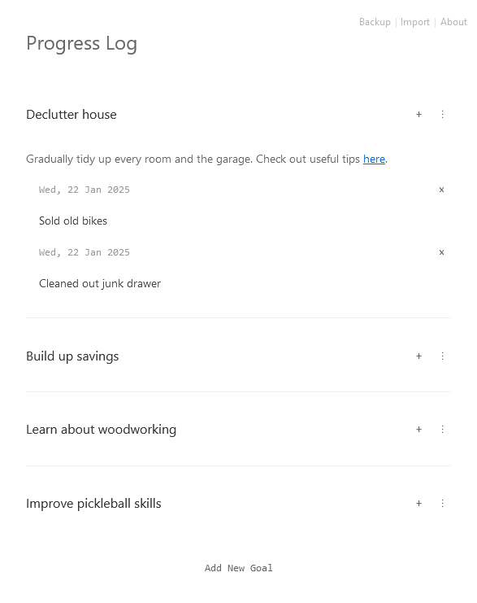

# Progress Log

A lightweight single-page application for tracking personal goals and logging daily progress. Built with pure JavaScript using Mithril.js.

Create a list of long-term goals (with optional descriptions) and then log every step you take to progress toward them.

## Features

- Goals can be edited or deleted
- Progress log entries can be deleted
- Minimalist, mobile-first responsive design
- Light and dark modes
- Markdown support in all text fields
- Offline-capable using local storage
- No installation or backend required
- JSON backup and import

## Screenshot

## Try it out!

https://jondoran.github.io/progresslog/

## Disclaimer

This is my first app, there are likely to be bugs and breaking changes due to my inexperience. Apologies in advance!
